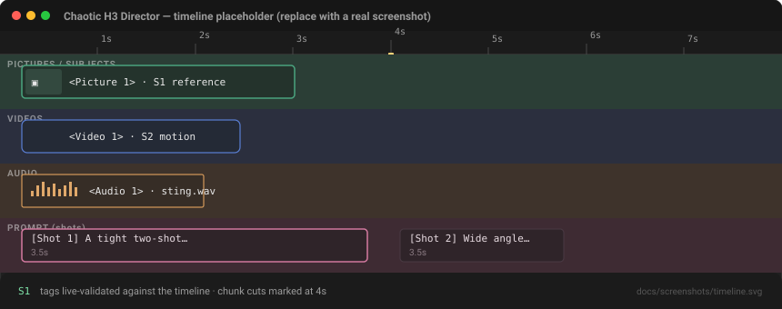
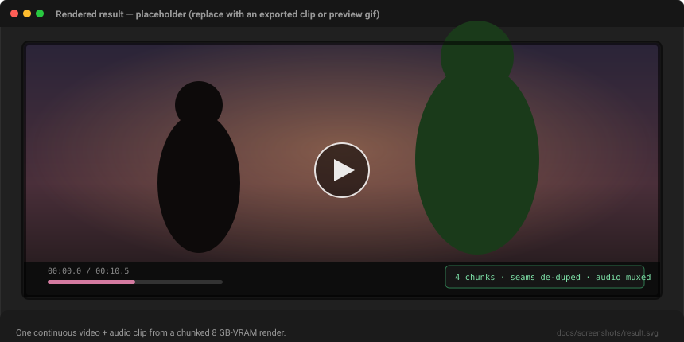

<div align="center">

# 🎬 Chaotic MinimaxH3 Director

**Timeline-based orchestration for [MiniMax H3](https://huggingface.co/docs) in ComfyUI — built for GPUs where a full 10–15 s clip will *not* fit in one pass.**

[](LICENSE)
[](pyproject.toml)
[]()
[](https://github.com/Luisacaotica/ChaoticMinimaxH3Director_WIP/actions/workflows/ci.yml)
[]()

*"Chaotic" is a nod to the wild local setup this was born on (nvfp4 pruned checkpoint, 4-step turbo LoRA, sage attention, custom sigma shift, chunk feed-forward). The node pack itself is the opposite of chaotic: it's the conductor that makes long-form H3 reliable on small VRAM.*

</div>

---

## Why does this exist?

MiniMax H3 renders a **video + audio pair** in one diffusion pass, and on a **8 GB-class GPU** a usable-resolution clip longer than ~5–8 seconds reliably runs out of memory — even at 1 megapixel, 15 s will OOM every time. The official tooling assumes the card can swallow the whole clip, which leaves people with small VRAM stuck manually chopping their scene into pieces, rendering them one at a time, clearing the cache between runs, and hand-stitching the seams.

**Chaotic MinimaxH3 Director automates all of that.** You author the entire scene on a visual timeline as if VRAM were unlimited. The Director:

1. chops the timeline into **VRAM-safe chunks** (at shot boundaries, or at sentence/beat splits inside long shots — never mid-word),
2. renders them **strictly one at a time** with a **full model unload + cache clear between every chunk**,
3. anchors each seam to the previous chunk's final frame (pixel-exact I2VA keyframe + reference picture),
4. stitches the result into **one continuous video + audio clip** with seam duplicates removed.

It is a **conductor, not an engine**: every model patch in your graph — turbo LoRA, MultiLoRA, EasyCache, spectrum, sage attention, scheduled attention, preview override, block swap, sigma shift, chunk feed-forward, W4A8 loaders — stays exactly as you wired it. The Director wraps the existing loader/sampler stack and treats it as opaque.

---

## ✨ Features

| | |
|---|---|
| 🗓️ **Visual timeline editor** | Four parallel tracks — pictures/subjects, videos, audio, and the prompt track. Drag-and-drop import, trim handles, thumbnails (video first-frame, audio waveform, image). |
| 🔖 **Semantic reference tags** | Each import gets a `<Video N>`, `<Audio N>`, `<Picture N>` or `<Subject N>` tag — *you* choose, because the choice is semantically meaningful to H3 (confusing `<Picture>` with `<Subject>` is a documented source of stuck frontal framing). |
| 🎚️ **Retention-aware strength** | Per-reference sliders that map onto H3's `retention_analysis` vocabulary: `fully_preserved` → `attribute_transfer` → `partially_copy` → `weak_reference` → `reference`, with the raw value underneath. |
| ✍️ **Live tag validation** | Type `S1` / `<Picture 2>` in the text track: valid tags highlight green with a hover mini-preview; undefined/out-of-range tags highlight in warning red — never silently ignored. |
| 🧱 **VRAM-safe chunking** | Fixed or **auto** chunk duration. Auto mode probes free VRAM, learns from this session's successful renders (records peak allocation per chunk), and shrinks + retries if a chunk OOMs. |
| 🔗 **Frame-accurate seams** | `keyframe+picture` (default): previous chunk's last frame is both a geometric I2VA keyframe re-injected at frame 0 *during* sampling, and a `<Picture N>` reference. The "last-frame glitch" class of bug is avoided by design — keyframes are never appended to the latent tail, so no trailing guide frames need cropping. |
| 🎞️ **Video context continuity** | Optionally feed the whole previous chunk as a `<Video N>` weak reference, so hard-cut multi-angle scenes keep motion/energy/lighting continuity across cuts. |
| 🎥 **Scrub + preview** | Drag on the ruler to scrub: the video frame / picture under the playhead renders in a live preview strip (play the trim range, or click any ref's **Preview** button). Make precision cuts against the actual footage. |
| 📚 **Reference library** | Drop media that is *just a reference* (look-and-feel, mood, subject sheets) into the library panel — it never appears on the timeline, but stays available to **every** shot as `<Picture N>`/`<Video N>`/`<Audio N>`. Timeline media and reference media never mix. |
| ✂️ **Render window (IN/OUT)** | Sony-Vegas style: set IN/OUT on the ruler (or at the playhead) and render **only that range** — iterate a single scene without re-rendering the whole project. The window is drawn, shaded and saved with the project. |
| 💾 **Project save / load** | Export the whole timeline (shots, refs, strengths, boundaries, render window) to a `.json` project file and load it back — or keep it in the workflow, since the editor already serializes into `timeline_data`. |
| 🎼 **Prompt formats** | Both verified H3 formats: the official field structure (`subject_definitions → summary → retention_analysis → detailed_description [Shot N]/MM:SS.sss → overall_soundscape → non_diegetic_music`) and the looser narrative scene-block format — switchable per project **and** per shot. |
| 🎬 **Editing mode** | Character swap, restyle, motion/expression transfer, audio style transfer — import the clip being edited with a "source" role, distinct from reference/mood-donor clips. |
| 📝 **Reference annotations** | Free-text notes per reference that flow into `subject_definitions:` (personality, voice, attributes the image doesn't show). |
| 🎭 **Mockup Editor (puppet stage)** | A separate node: compose PNG sprites, text, and video clips as layers, keyframe their position/scale/rotation/opacity (opacity = reference strength), add cuts by when layers appear, and scrub with an audio track. Render the crude animation and wire it into the Director's `mockup` input — MiniMax H3 reads the composition, positions, and motion off the mockup and turns it into a finished clip. |
| 🧪 **Zero-GPU prompt preview** | The companion `ChaoticH3PromptAssembler` node prints the exact per-chunk prompts + chunk plan without spending a single render. |

---

## 🚀 Install

```bash
cd ComfyUI/custom_nodes
git clone https://github.com/Luisacaotica/ChaoticMinimaxH3Director_WIP.git
```

Restart ComfyUI. The nodes appear in the **`Chaotic/H3 Director`** menu and the timeline editor loads in the browser.

**No extra Python dependencies.** The engine reuses `av`, `torchaudio`, `numpy` and `torch` already shipped with your ComfyUI install.

> The stock `MiniMaxH3ReferenceToVideo` node (or Deno variant) does **not** need to be in the graph anymore — the Director replicates its conditioning path internally, then adds chunking, seam anchoring and stitching on top.

---

## 🧭 Getting started

### 1. Load the example workflow

Open [`workflows/ChaoticDirector_H3.json`](workflows/ChaoticDirector_H3.json) — a 3-shot, ~10.5 s scene that demonstrates automatic chunking at 5 s chunks with auto-bridged seams. Every loader and patch node from the reference graph is preserved; the Director replaces the sampler/conditioning/decode/cache-clear machinery.

### 2. Wire the Director like the sampler it replaces

```
model       <- the FINAL patched model (after turbo LoRA / MultiLoRA / EasyCache /
               spectrum / sage attention / scheduled attn / preview override /
               block swap / sigma shift / chunk feed-forward) — the node that
               used to feed BasicGuider
clip        <- your CLIP (e.g. CLIPLoaderGGUF → UniBlockSwapTE)
vae         <- the video VAE
audio_vae   <- the audio VAE
sampler     <- (optional) your MiniMaxH3TurboSampler — if omitted the Director
               builds a KSampler from sampler_name/scheduler/steps
sigmas      <- (optional) SIGMAS from your BasicScheduler — if omitted the
               Director builds its own schedule from the wired model
seed        <- any seed node
width/height<- your resolution selector

images      -> CreateVideo.images        audio -> CreateVideo.audio
```

Outputs are `IMAGE` + `AUDIO` in the exact stock shape, so `CreateVideo` / `SaveVideo` / VHS consume them unchanged.

### 3. Mockup Editor → storyboard → Director

Open a **Chaotic H3 Mockup Editor** node (under `Chaotic/H3 Director`) to sketch the staging:

1. **Import** background/character/prop PNGs (with transparency), videos, or add **text** layers.
2. **Pose** them on the stage — layer order is front-to-back; drag a layer to move it (auto-keys), or set the playhead, press **Key**, and adjust X/Y/Scale/Rotation/Opacity in the inspector.
3. Between keyframes the motion is interpolated; a layer is only visible between its first and last keyframe — that's how you make cuts and entrances.
4. **Opacity is reference strength** — a 40% character literally shows the background through it, exactly like a weak `<Picture>` reference.
5. Add an **audio track** to scrub while you animate.
6. **Render** the mockup to frames, then wire its `IMAGE` output into the Director's optional **`mockup`** input.

The Director then feeds every chunk its slice of the mockup as a `fully_preserved <Video N>` storyboard reference — H3 reproduces the layout, positions, layering, and motion as the blueprint for the final clip. It will look like a bad mockup — that's the point.

### 4. Convert your existing workflow in one command

`tools/build_workflow.py` rewires any **single-pass** H3 workflow into the Director graph — every loader/patch node kept byte-for-byte, discovery is link-driven (no hard-coded node ids):

```bash
python tools/build_workflow.py path/to/MiniMax_H3_MYWFEXAMPLE.json
python tools/verify_workflow.py      # strict structural validation
```

> Pre-chunked manual workflows (e.g. `MinimaxLuisa_Chunked.json`) are exactly the thing this pack automates — the Director *replaces* them, so they are not a valid source.

---

## 🎛️ The timeline editor

The Director node embeds a full DOM timeline widget (a custom ComfyUI widget — not sockets):

- **Import media** by drag & drop onto a track or via file dialog. Thumbnails are auto-generated (video: first frame; audio: waveform strip; picture: the image).
- **Trim** any reference with its in/out handles directly on the timeline.
- **Strength sliders** per reference map onto H3's `retention_analysis` bands — the label shown is what the Director will actually emit.
- **Subject shortcuts** — type `S1`/`S2` (or `@name`) in a shot's text; it is live-validated against the references active at that timeline position.
- **Chunk boundaries** are drawn on the timeline so you see exactly where an automatic cut will fall — drag a boundary to pin it, or snap it to a shot break.
- **Project scaffolding** panel: format toggle (official / narrative), LoRA trigger token, style clarification line, and the full field set for the chosen format. Switching format updates the field set *instantly* — no re-click needed.
- **Per-shot format override** — strict shot/timestamp control on action sequences, looser narrative phrasing on dialogue, in the same timeline (the format is shown as a badge right on the shot block).
- **Scrub preview** — drag on the ruler to move the playhead; the video or picture under it appears in the preview strip, with its own play/seek controls locked to the reference's trim range.
- **Reference library** — drop files into the library panel (or flip any ref to **Library** placement) to keep them out of the timeline but available to every shot.
- **Render window** — set **IN/OUT** markers on the ruler (or at the playhead via the toolbar buttons); everything outside the window is shaded, and only that range renders.
- **Save / Load** — export/import the full project as a `.json` file (the reference LTX-style workflow: works standalone, survives even if the workflow JSON is lost).
- **Annotations** on any reference flow into `subject_definitions:`.

Widget edits serialize straight back into the node's `timeline_data` string, so timelines survive save/load/reload like any widget.

---

## 🧠 How chunking & VRAM safety work (the whole point)

- **Chunk duration**: fixed seconds, or **auto** — probes free VRAM (`torch.cuda.mem_get_info()`), learns from this session's successful runs, and picks the largest chunk that has *actually* fit (grown at most 1.5× between runs).
- **Strictly sequential. One chunk at a time. Never parallel.**
- Between every chunk the Director:
  1. unloads the diffusion model, CLIP/text-encoder and VAEs from VRAM (`model_management.unload_all_models()` + `soft_empty_cache()` — the same calls the manual cache-clear nodes make, but owned and guaranteed);
  2. clears the CUDA cache;
  3. moves chunk tensors to CPU before starting the next chunk.
- **Seam continuity modes** (all automatic): `keyframe+picture` (default), `picture` (soft, classic H3 behavior), `keyframe` (geometry only), `none` (hard cut).
- **Video context** (optional): previous chunk's full video as a `<Video N>` weak reference for multi-angle hard cuts.
- **Stitching**: chunks are concatenated with the shared seam frame de-duplicated and per-chunk audio muxed into one continuous track (`drop_seam` is on whenever keyframing is on).
- **OOM resilience**: if a chunk still OOMs (a first-run misjudgment), the Director detects it, shrinks the chunk budget, and retries the remaining timeline — no wasted frames.

---

## 🎼 Prompt format support

Per the official MiniMax H3 prompting rules:

- **T2VA** and **full-reference** modes are mutually exclusive — the assembler never mixes frame-anchor syntax with reference labels.
- Full-reference mode uses the fixed field structure with `[Shot N]` blocks and `MM:SS.sss` cut timestamps.
- `retention_analysis` uses the official vocabulary; `weak_reference` is stated in *both* `subject_definitions` and `retention_analysis` with an explicit "not copied" clause, per the official guidance.
- LoRA trigger tokens go as the literal first token of the prompt followed by a period, with a clarifying line that the LoRA's influence stays visual.
- Multi-character scenes refer to subjects by persistent shorthand (`S1`, `S2`…) tied to a physical description.

---

## 🧪 Development

```bash
python -m pytest tests/ -q        # pure-layer unit tests (no GPU, no ComfyUI)
python tools/build_workflow.py    # rebuild the example workflow
python tools/verify_workflow.py   # validate it structurally
python tools/smoke_check.py       # import + registration check under ComfyUI's python
python tools/dry_run_engine.py    # (under ComfyUI's python) full conditioning-path dry run
```

The **engine dry run** is the strongest verification short of a real render: it
runs `ChunkRenderer.render_chunk` end-to-end against your *actual* installed
`comfy` modules (stock `nodes_minimax_h3` helpers, `node_helpers`, `comfy.samplers`,
`latent_preview`) with mocked model/clip/VAEs, and asserts the conditioning keys
(`minimax_refs`, `minimax_keyframes`, `minimax_frame_count`), the keyframe
payload shape (`resolved_frame_index`/`image`/`latent` — the exact contract
`comfy/model_base.py` consumes), the `comfy.samplers.sample` call contract, and
the `[F,H,W,3]` frames + `[1,C,L]` audio decode shapes. CI runs the unit tests,
syntax checks and workflow verification on every push.

**Layout**

```
timeline.py           data contract (JS widget ↔ Python, single source of truth)
chunking.py           chunk planner (shot boundaries, sentence splits, pinned cuts)
prompt_assembly.py    prompt builder (official + narrative formats, retention bands)
stitching.py          seam de-dup + audio muxing
vrma.py               VRAM probing, unload/clear cycle, auto chunk sizing
engine.py             conditioning + I2VA keyframes + sampling + decode
nodes.py              ComfyUI node classes
mockup.py                Mockup Editor scene renderer (keyframes -> frames)
web/js/chaotic_director.js   the timeline editor widget
web/js/chaotic_puppet.js     the Mockup Editor stage widget
tools/                workflow builder / verifier / smoke check
workflows/            example workflow
```

The engine's conditioning path is verified line-by-line against stock ComfyUI internals (`comfy_extras.nodes_minimax_h3`, `comfy.samplers`, `latent_preview`, io-`CreateVideo`).

---

## 🖼️ Screenshots

| Timeline editor | Rendered result |
|---|---|
|  |  |

*Placeholders — replace them with a real screenshot of the timeline widget and an exported clip/preview GIF before release (`docs/screenshots/`).*

---

## 🩺 FAQ / Troubleshooting

**Q: The timeline widget is blank / tiny.**  
Resize the node — the editor needs ~700 px width. If it stays blank, check the browser console (`F12`) for `[ChaoticDirector] init failed` messages and open an issue with the traceback.

**Q: I wired my old sampler output into the Director by mistake.**  
`Director.model` must be the *final patched* model (the node that used to feed `BasicGuider`), not the raw `UNETLoader`. The verifier flags this (`Director.model fed directly by UNETLoader`).

**Q: First chunk always succeeds but chunk 2+ OOMs.**  
That's the classic VRAM-fragmentation failure mode — the Director's unload/clear cycle exists precisely to prevent it. If it still happens, lower `chunk_seconds` or switch to `auto`.

**Q: Seam looks slightly different from the previous chunk's last frame.**  
`keyframe` mode is geometry-exact; if the model still "drifts" the anchor, use `keyframe+picture` (adds the `<Picture N>` reference) — this matches the strongest continuity the H3 conditioning supports.

**Q: Audio-only output?**  
Not possible — H3 always produces a video+audio pair (hard model limitation, not a workaround).

---

## 🚫 Non-goals

- Not a general video editor (no color grading, transitions, effects).
- Not audio-only output (hard model limitation).
- Local-only — no cloud/API MiniMax H3.

---

## 🙏 Credits & prior art

- **MiniMax H3** official prompting guide and [Comfy-Org reference implementation](https://huggingface.co/Comfy-Org/MiniMax-H3) — ground truth for prompt structure, retention vocabulary, and reference semantics.
- **LTX "Director"** — the timeline-track UX inspiration.
- **VideoHelperSuite (VHS)** — the de facto video I/O conventions the pack composes with.
- The local H3 node stack this was built against: pruned NVFP4 checkpoint, 4-step turbo LoRA, Qwen3VL-32B text encoder (GGUF Q2_K), sage attention, sigma shift, chunk feed-forward, beta scheduler, `exp_heun_2_x0_sde`.

## 📄 License

[MIT](LICENSE)
